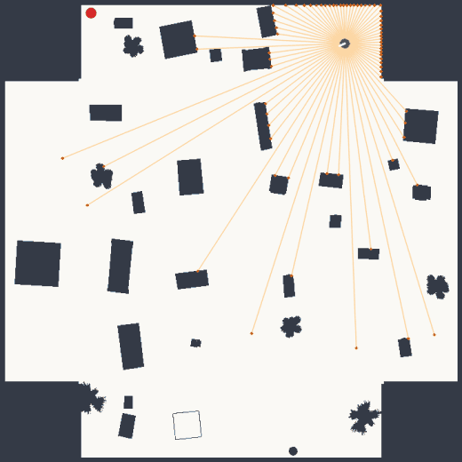
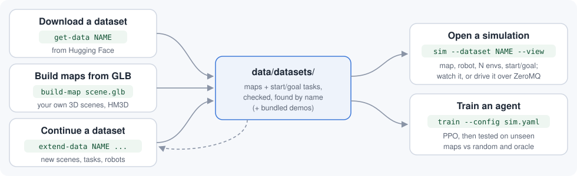

# hm3denv

Bộ giả lập để huấn luyện robot di chuyển trong nhà: mặt bằng nhà thật, kích thước và cảm biến
của robot thật, API chuẩn [Gymnasium](https://gymnasium.farama.org/).
[English](README.md)

<p align="center"></p>

## Tính năng

Mỗi tính năng là **một lệnh**. Trên Windows chạy file `.bat` (trong cmd hoặc PowerShell, hoặc bấm
đúp); trên Linux / macOS chạy file `.sh`. Lần đầu chạy một tính năng, lệnh tự cài những gì cần
vào `.venv`. Chưa biết bắt đầu từ đâu? Chạy **`.\app.bat`** (`./app.sh`): menu chọn mọi tính năng.

| Tính năng | Windows | Linux / macOS | Hướng dẫn (tiếng Anh) |
|---|---|---|---|
| **Tải dataset** từ Hugging Face vào `data/datasets`, dùng được ngay | `.\get-data.bat isb-svg-v1` | `./get-data.sh isb-svg-v1` | [get-data](docs/features/get-data.md) |
| **Mở giả lập**: chọn dataset, map, robot, số môi trường, điểm xuất phát / đích hoặc cặp có sẵn; xem trên trình duyệt, hoặc để chương trình của bạn điều khiển (ZeroMQ) | `.\sim.bat --dataset demo-svg --view` | `./sim.sh --dataset demo-svg --view` | [sim](docs/features/simulate.md) |
| **Huấn luyện agent** (PPO) và kiểm tra trên map chưa từng thấy | `.\train.bat --dataset isb-svg-v1` | `./train.sh --dataset isb-svg-v1` | [train](docs/features/train.md) |
| **Tạo map từ file GLB** (scene của bạn, HM3D) | `.\build-map.bat D:\scenes\house.glb` | `./build-map.sh ~/scenes/house.glb` | [build-map](docs/features/build-map.md) |
| **Sinh tiếp dataset**: thêm scene, thêm task, thêm robot | `.\extend-data.bat svg-v1 --status` | `./extend-data.sh svg-v1 --status` | [extend-data](docs/features/extend-data.md) |



## Bắt đầu nhanh

Cần git và Python 3.10–3.12 ([python.org](https://www.python.org/downloads/); trên Windows tick
*Add python.exe to PATH*).

```bash
git clone https://github.com/TrKimHieu/2D_Navigation_Sim
cd 2D_Navigation_Sim
```

Windows:

```bat
.\sim.bat --dataset demo-svg --view
```

Linux / macOS:

```bash
./sim.sh --dataset demo-svg --view
```

Lần đầu lệnh tạo `.venv` (vài phút), sau đó trình duyệt mở trang cho thấy robot chạy tới đích
trong một map demo. Dataset demo nhỏ (`demo-svg`, `demo-grid`) có sẵn trong repo; dataset đầy
đủ tải bằng `get-data` (cần tài khoản Hugging Face miễn phí và gửi yêu cầu truy cập, xem
[get-data](docs/features/get-data.md)).

## 1. Tải dataset — `get-data`

```bat
.\get-data.bat                    :: liệt kê dataset bạn được phép tải, chọn bằng số
.\get-data.bat isb-svg-v1 svg-v1  :: tải theo tên
.\get-data.bat --all              :: tải hết những gì bạn có quyền
```

Dữ liệu vào `data/datasets/<tên>` của repo và được kiểm tra sha256; sau đó dùng theo tên ở mọi
nơi (`sim`, `train`, `gym.make(..., dataset="<tên>")`), không cần di chuyển hay cấu hình.
Lỗi được báo rõ ràng kèm mã thoát: 3 = không cài được `huggingface_hub`, 4 = chưa đăng nhập hoặc
token sai/hết hạn (`hf auth login`), 5 = tài khoản chưa được cấp quyền (gửi yêu cầu trên
[trang dataset](https://huggingface.co/datasets/TranKimHieu/2D_Navigation_Sim) và chờ duyệt),
6 = không kết nối được Hugging Face.

## 2. Mở giả lập — `sim`

```bat
.\sim.bat --dataset demo-svg --view                                     :: agent oracle, xem trên trình duyệt
.\sim.bat --dataset isb-svg-v1 --robot pal_tiago --num-envs 4 --view    :: 4 môi trường song song
.\sim.bat --dataset demo-svg --map demo-S001_s0 --start 2.48,12.36,0 --goal 4.84,10.72 --view
.\sim.bat --dataset demo-svg --map demo-S001_s0 --task 3                :: cặp xuất phát/đích có sẵn số 3
.\sim.bat my_sim.yaml --serve --view                                    :: chương trình của bạn điều khiển
```

- Xuất phát / đích tính bằng mét trong hệ tọa độ map (góc theta tính bằng radian, mặc định quay
  về phía đích); với dataset dạng lưới là ô `hàng,cột`. Điểm nằm trong tường hoặc đích không tới
  được sẽ bị từ chối kèm lý do.
- Cấu hình dài hơn viết trong file YAML (dataset, robot, split, `num_envs`, danh sách map, danh
  sách episode, bộ lọc task, tham số môi trường); ví dụ: `.\sim.bat demo`, `.\sim.bat custom_pairs`
  (trong `src/hm3denv/configs/sim/`).
- `--serve`: giả lập chờ yêu cầu JSON qua ZeroMQ ở `tcp://127.0.0.1:5555`. Chương trình của bạn
  gửi hành động và nhận quan sát / reward / kết quả episode liên tục — bằng Python
  (`hm3denv.sim.SimClient`, xem `examples/remote_client.py`) hoặc bất kỳ ngôn ngữ nào có ZeroMQ.
  Giao thức: [sim](docs/features/simulate.md#driving-it-from-your-program---serve).

## 3. Huấn luyện — `train`

```bat
.\train.bat                                           :: dữ liệu demo: kiểm tra nhanh ~5 phút
.\train.bat --dataset isb-svg-v1 --robot pal_tiago --steps 2000000
.\train.bat --config my_sim.yaml --steps 2000000      :: dùng chung file cấu hình với sim
```

Lần đầu cài PyTorch (CPU) và Stable-Baselines3. Mô hình lưu ở `runs/<dataset>_<robot>/`, cuối
cùng được kiểm tra trên split `test` (các tòa nhà chưa thấy khi huấn luyện), so với agent ngẫu
nhiên và oracle. Trên dữ liệu demo, vài phút huấn luyện cho **0 % thành công — điều này là bình
thường**; hãy xem cột `progress`.

## 4. Tạo map từ GLB — `build-map`

```bat
.\build-map.bat D:\scenes\house.glb                    :: một file
.\build-map.bat D:\scenes                              :: mọi file .glb trong thư mục
.\build-map.bat D:\hm3d\val --name hm3d-val            :: một split HM3D (thư mục <id>-<hash>)
.\build-map.bat house.glb --env grid                   :: map dạng lưới
```

GLB được chép vào `data/raw/glb/`, rồi qua đúng pipeline của các dataset đã công bố: cắt từng
tầng, vector hóa (SVG) hoặc chia ô (lưới), sinh task, kiểm tra trên mesh 3D, ảnh preview. Kết quả
là dataset `data/datasets/my-maps` (hoặc `--name`). Chạy lại với cùng `--name` sẽ **thêm** scene
mới vào dataset đó. Tầng bị sai (lật ngược, gộp tầng): sửa bằng `hm3d review`, rồi chạy lại
`build-map`.

## 5. Sinh tiếp dataset — `extend-data`

```bat
.\extend-data.bat svg-v1 --status          :: dataset đang có gì, có thể thêm gì
.\extend-data.bat svg-v1 --new-scenes      :: thêm mọi GLB trong data\raw\glb chưa có trong dataset
.\extend-data.bat svg-v1 --add-tasks 10    :: thêm 10 task cho mỗi map
.\extend-data.bat svg-v1 --robots kobuki   :: sinh task cho robot khác
```

Phần đã có không thay đổi (map và task giữ nguyên từng byte), scene cũ giữ nguyên split (task đã
dùng để huấn luyện không bao giờ chuyển sang test). Kết quả ghi ra bản sao `<tên>-ext` (hoặc
`--out`, `--in-place`), manifest có thêm mục `history`. Dataset HM3D cần file GLB của các scene
cần cắt hoặc kiểm tra 3D (hoặc dùng `--no-verify`).

## Thư mục

```
get-data / sim / train / build-map / extend-data / app (.bat, .sh)   các tính năng
setup.bat, setup.sh          tự cài / cập nhật .venv (.\setup.bat --all: cài tất cả)
data/                        mọi thứ tải về hoặc tạo ra: data/datasets/<tên>, data/raw/glb, ...
src/hm3denv/                 package Python (môi trường, giả lập, công cụ dataset)
examples/                    quickstart.py, train_ppo.py, remote_client.py
docs/                        hướng dẫn (tiếng Anh)
```

Nếu bạn có thư mục `workspace/` từ phiên bản cũ: chuyển nội dung vào `data/` (hoặc đặt biến
`HM3D_WORKSPACE` trỏ tới nó).

Giấy phép MIT. Các dataset tạo từ HM3D tuân theo điều khoản sử dụng HM3D của Matterport.
